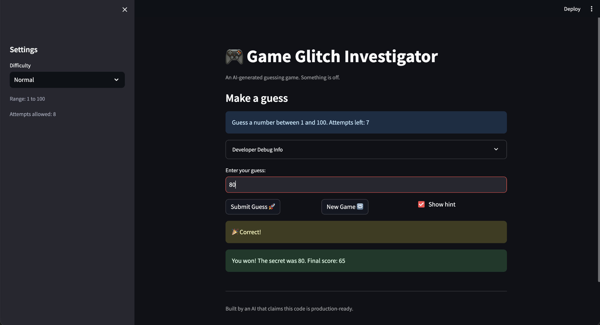

# 🎮 Game Glitch Investigator: The Impossible Guesser

## 🚨 The Situation

You asked an AI to build a simple "Number Guessing Game" using Streamlit.
It wrote the code, ran away, and now the game is unplayable. 

- You can't win.
- The hints lie to you.
- The secret number seems to have commitment issues.

## 🛠️ Setup

1. Install dependencies: `pip install -r requirements.txt`
2. Run the broken app: `python -m streamlit run app.py`

## 🕵️‍♂️ Your Mission

1. **Play the game.** Open the "Developer Debug Info" tab in the app to see the secret number. Try to win.
2. **Find the State Bug.** Why does the secret number change every time you click "Submit"? Ask ChatGPT: *"How do I keep a variable from resetting in Streamlit when I click a button?"*
3. **Fix the Logic.** The hints ("Higher/Lower") are wrong. Fix them.
4. **Refactor & Test.** - Move the logic into `logic_utils.py`.
   - Run `pytest` in your terminal.
   - Keep fixing until all tests pass!

## 📝 Document Your Experience

**Game's purpose.** A number-guessing game where the player picks a difficulty (range), gets a secret number in that range, and uses "Higher"/"Lower" hints to guess it. The app uses Streamlit with a Developer Debug Info tab that shows the secret for debugging.

**Bugs found.**
1. **Submit on Enter** – Pressing Enter didn’t submit the guess; only clicking the button worked.
2. **Backwards hints** – After submitting, hints said "go lower" even when the guess was below the secret (e.g. guess 9, secret 100 still said go lower).
3. **Secret outside range** – The chosen difficulty range wasn’t respected; the secret could be outside the selected min/max.
4. **Secret reset on rerun** – The secret number changed on every Streamlit rerun (e.g. every "Submit" click), so the game was unwinnable.

**Fixes applied.**
- Stored the secret in `st.session_state` so it persists across reruns and stays within the selected difficulty range.
- Fixed hint logic so "Higher"/"Lower" (and "Too Low"/"Too High") match the actual comparison with the secret; verified with manual play and `pytest` (e.g. `check_guess(9, 100)` returns `'Too Low'`).
- Addressed Enter-key submit (Streamlit form/button behavior) so submitting works as expected.
- Moved core logic into `logic_utils.py` and kept tests passing so behavior stays correct.

## 📸 Demo

## 🚀 Stretch Features

- [ ] [If you choose to complete Challenge 4, insert a screenshot of your Enhanced Game UI here]
